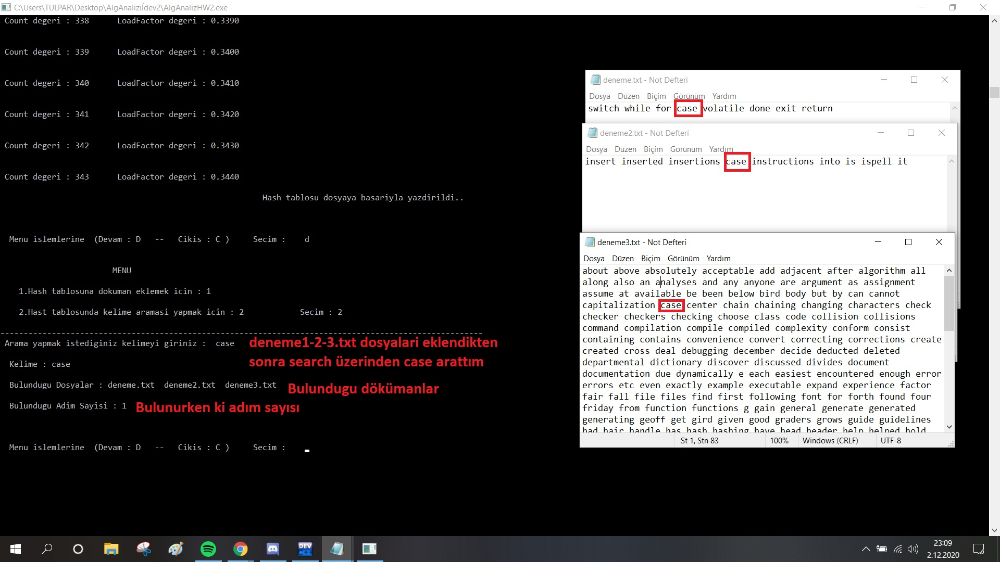
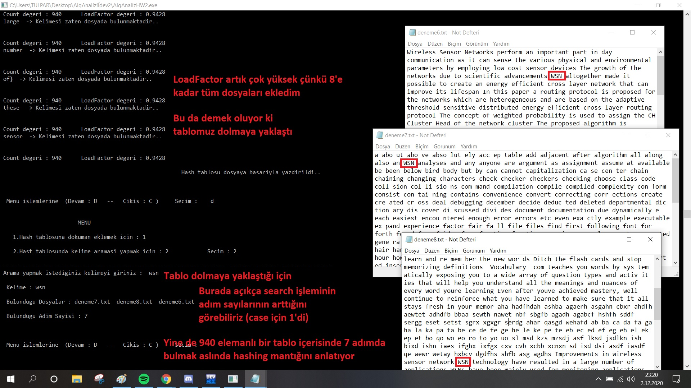

# Hash Table Word Search in Files
> **Analysis of Algorithm Assignment-2 (3rd year of University)**

# Assignment

By saving the words in the txt documents given in the same file in a common Hash Table, create the program that shows how many steps the searched words are in and in which txt documents the searched word is found.

## Getting Started

First of all, you should save the documents containing your own words, such as the txt documents given above, to the program. For this, after starting the program, save the files containing your words to the Hash Table using option 1.

> **Note :** Do not forget to write the full name when specifying the documents after option 1. **(Ex : test.txt)**

After the files you add with Option 1, a hash table named **HashTable.txt** is created in the file where the program is located. The HashTable.txt file contains information about your words. After this txt file is created, you can search for words by selecting Option 2 and see which txt files this word is in.

> **Note :** After the program is **run once**, there is no need to repeat the transactions made with Option 1. The program **reads the values in HashTable.txt** and allows the user to search without making preparations.

## Examples

Given **"case"** word found in **"deneme1.txt,deneme2.txt,deneme3.txt"**

As the Hash Table gets full, the steps to find the words increase. In the previous example, the word **"case"** was found in **step 1**, while in the example below, the word **"WSN"** was found in **step 7**.

